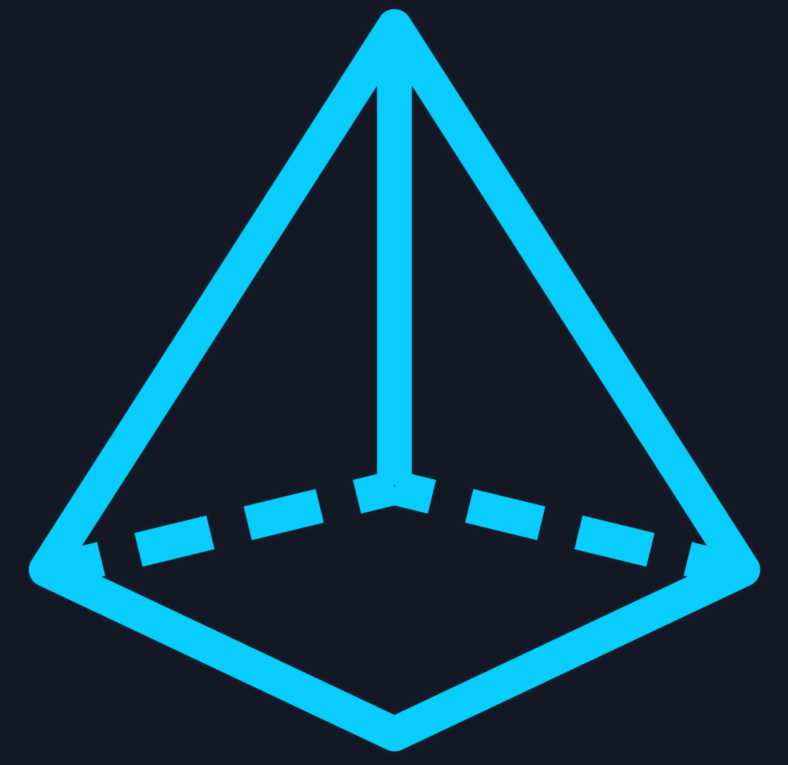

<p align="center">
  
</p>

<h1 align="center">Prism — PM Research Intelligence IDE</h1>

<p align="center">
  <strong>AI-powered voice interviews that turn customer conversations into structured product intelligence.</strong>
</p>

<p align="center">
  <a href="https://www.youtube.com/watch?v=ozecW8mKhUw">Video Demo</a> &middot;
  Cartesia x Anthropic Voice Agents Hackathon &middot; Feb 7–8, 2026
</p>

---

## What is Prism?

Prism is an AI-powered research IDE that conducts autonomous customer interviews via voice and surfaces structured product intelligence — no PM needs to be on the call.

A customer clicks a link, talks to an AI interviewer, and the PM opens Prism to find organized issues, personas, quotes, competitive intel, and analytics waiting for them.

## Demo

[](https://www.youtube.com/watch?v=ozecW8mKhUw)

## How It Works

```
Customer clicks link
        |
        v
  LiveKit Voice Room
  (Cartesia STT + Claude Sonnet + Cartesia TTS)
        |
        v
  Interview ends --> Claude extracts structured JSON
        |
        v
  FastAPI writes extraction to Notion Extractions DB
        |
        v
  Notion Agent 1: Extraction Processor
    - Fans out JSON into Personas, Quotes, Issues DBs
    - Enriches each issue (engineer matching, graph data, Exa trigger)
        |
        v
  Notion Agent 2: Persona Summarizer
    - Generates persona summary for each new persona
        |
        v
  Exa competitive search (for flagged issues)
    - Populates Competitive Landscape DB
        |
        v
  PM opens Prism IDE --> sees everything, organized
```

## Technical Stack

| Layer | Technology |
|-------|-----------|
| **Frontend** | React 19, TypeScript 5.9, Vite 7, Tailwind CSS v4 |
| **IDE Layout** | react-resizable-panels (4-panel resizable interface) |
| **UI Components** | Radix UI primitives, shadcn/ui, Lucide icons |
| **Graphics** | OGL WebGL prismatic background with custom GLSL shaders |
| **Charts** | Recharts (bar, line, pie, heatmap) |
| **Markdown** | react-markdown + remark-gfm |
| **Voice Agent** | LiveKit Agents Framework + Cartesia Ink Whisper STT + Claude Sonnet LLM + Cartesia Sonic 2 TTS + Silero VAD |
| **Turn Detection** | MultilingualModel (auto-offloads to LiveKit Cloud) |
| **Noise Cancellation** | livekit-plugins-noise-cancellation |
| **Backend** | FastAPI + Uvicorn (port 8000) |
| **Validation** | Pydantic v2 |
| **Persistence** | Notion API (5 relational databases) |
| **Automation** | Notion Custom Agents (alpha) — extraction processing + persona summarization |
| **Competitive Intel** | Exa API (triggered by Notion Agent when issues are flagged) |
| **Post-Interview Analysis** | Claude Sonnet — markdown report + structured JSON extraction |

## Product Flow

1. **Landing** — Hero page with animated WebGL prismatic background
2. **Intake Form** — User provides name, company, role, problem description, urgency
3. **Voice Interview** — LiveKit room with AI interviewer (sub-1s latency, fully streaming)
4. **Post-Processing** — Claude analyzes transcript twice: a markdown report for the PM, and a structured JSON extraction (personas, quotes, issues)
5. **Notion Persistence** — Extraction JSON writes to the Extractions DB via FastAPI
6. **Notion Agent: Extraction Processor** — Triggers on new extraction, fans out JSON into Personas/Quotes/Issues DBs with full relational linking, enriches each issue with engineer matching, graph data, and Exa trigger flags
7. **Notion Agent: Persona Summarizer** — Triggers on new persona, generates a concise third-person summary
8. **Exa Competitive Search** — Issues flagged with Exa Trigger get competitive landscape research populated automatically
9. **PM IDE View** — 4-panel resizable interface with live data from Notion

## IDE Panels

| Panel | Position | Contents |
|-------|----------|----------|
| **Context** | Left | Personas (expandable speakers), related issues per speaker, competitors with sentiment |
| **Interview** | Center | LiveKit voice session, recent quotes feed |
| **Analysis** | Right | Issues sorted by severity, engineering matching, analytics summary bar |
| **Research Log** | Bottom | Tabbed: Quotes (filterable by sentiment), Competitive (grid), Analytics (bar charts) |

## Notion Databases

Five relational databases with cross-references:

- **Extractions** — Raw structured JSON from Claude's post-interview analysis. Triggers the Extraction Processor agent.
- **Issues** — Pain points, feature requests, workflow gaps. Enriched by Extraction Processor with engineer matching, graph type, graph data JSON, and Exa trigger flag.
- **Personas** — User archetypes extracted from interviews (type, speaker name, use case, communication style, goals, constraints). Enriched with a generated persona summary.
- **Quotes** — Verbatim quotes with sentiment, type, and relations to personas/issues/competitors.
- **Competitive Landscape** — Competitors populated via Exa search when issues are flagged.

```
                    Interview ends
                         |
                         v
              Claude extracts JSON
                         |
                         v
                  Extractions DB
                         |
                         v
         Notion Agent: Extraction Processor
         (fans out into Personas, Quotes, Issues)
                    /    |    \
                   v     v     v
            Personas  Quotes  Issues
               |                 |
               v                 v
       Notion Agent:     Enrichment (engineer
       Persona Summary   matching, graph data,
                         Exa trigger)
                              |
                              v
                    Competitive Landscape
                    (populated via Exa)
```

### Cross-references

```
Quotes --> Issues (Related Issue)
Quotes --> Personas (Related Persona)
Quotes --> Competitive Landscape (Competitor Mentioned)
Issues --> Personas (Related Persona)
Issues --> Quotes (Related Quotes)
Issues --[Exa Trigger]--> Competitive Landscape
```

## Notion Custom Agents

We use Notion Custom Agents (alpha) to automate the pipeline from raw extraction to enriched, linked data — no backend orchestration needed after the initial write.

### Agent 1: Extraction Processor

**Trigger:** New page added to Extractions DB.

Parses the `Extraction Data` JSON field and fans it out into three databases in strict order:

1. **Personas** — creates a page per persona, tracks page IDs
2. **Quotes** — creates a page per quote, links to persona via `temp_persona_index`
3. **Issues** — creates a page per issue, links to persona and quotes via index references

After creating each issue, the agent enriches it inline:

| Property | What the agent generates |
|----------|------------------------|
| Engineer Matching | 1-2 sentence description of ideal engineer owner |
| Graph Type | Best visualization (Bar / Trend / Heatmap / None) |
| Graph Data | JSON string with `labels`, `values`, `label` for chart rendering |
| Exa Trigger | `true` if the issue mentions competitors or would benefit from competitive research |

Finally marks the Extraction page status as **Processed** (or **Error** on failure).

### Agent 2: Persona Summarizer

**Trigger:** New page added to Personas DB.

Reads the persona's properties (type, speaker name, use case, communication style, goals, constraints) and writes a 2-3 sentence `Persona Summary` in third person — capturing who they are, what they care about, and their key constraints.

## API Endpoints

| Method | Endpoint | Description |
|--------|----------|-------------|
| `GET` | `/api/token` | Generate LiveKit room access token |
| `POST` | `/api/user-intake` | Save pre-interview intake form |
| `POST` | `/api/analyze-transcript` | Claude-powered transcript analysis |
| `GET` | `/api/analyses` | Retrieve analysis history |
| `GET` | `/api/project/context` | Fetch all data (issues, personas, quotes, competitors) |
| `GET` | `/api/project/analytics` | Aggregated statistics and metrics |
| `POST` | `/api/extraction-summary` | Generate extraction summaries |
| `POST` | `/api/exa-research` | Trigger competitive research via Exa |
| `GET` | `/health` | Service health check |

## Repo Structure

```
prism/
  frontend/                  # React + TypeScript IDE
    src/
      App.tsx                # View routing (hero -> form -> interview -> ide)
      components/
        Prism.tsx            # WebGL prismatic background (OGL + GLSL)
        HeroPage.tsx         # Landing page
        UserForm.tsx         # User intake form
        LiveKitSession.tsx   # Voice interview component
        AnalysisPanel.tsx    # Post-interview Claude analysis
        shared/              # Toolbar, StatusBar, PanelContainer
        charts/              # Heatmap, LineChart, PieChart
      panels/                # ContextPanel, InterviewPanel, AnalysisPanel, ResearchLogPanel, InsightsPanel
      layouts/IDELayout.tsx  # Resizable 4-panel layout
      context/               # ResearchContext (cross-panel state)
      hooks/                 # useIssues, usePersonas, useQuotes, useCompetitors, useAnalytics, useExaTrigger, useTranscriptCollector
      services/api.ts        # API client
      types/                 # TypeScript types matching Notion schema
      lib/                   # Constants and utilities
      utils/                 # Chart utilities
  backend/
    main.py                  # FastAPI app (port 8000)
    config.py                # Notion DB IDs, env config, CORS
    models/                  # Pydantic models (issue, persona, quote, competitor, extraction)
    routes/                  # extraction, project, exa, interview
    services/                # notion_reader, notion_writer, notion_mapper
    exa/                     # Exa competitive research integration
    voice_livekit/           # LiveKit voice agent (agent.py)
  docs/                      # Additional documentation
```

## Getting Started

### Prerequisites

- **Node.js** (for the frontend)
- **Python 3.13** (3.14 not supported by LiveKit)
- A [LiveKit Cloud](https://livekit.io/) account
- A [Notion](https://www.notion.so/) integration with access to 5 databases
- API keys for [Anthropic](https://console.anthropic.com/), [Cartesia](https://www.cartesia.ai/), and [Exa](https://exa.ai/)

### Environment Variables

Create `backend/.env`:

```
NOTION_INTERNAL_INTEGRATION_SECRET=  # Notion integration token
LIVEKIT_API_KEY=
LIVEKIT_API_SECRET=
LIVEKIT_URL=                         # wss://your-project.livekit.cloud
ANTHROPIC_API_KEY=
CARTESIA_API_KEY=
EXA_API_KEY=
```

### Running

Prism requires **3 concurrent processes**:

**1. Frontend:**

```bash
cd frontend
npm install
npm run dev          # http://localhost:5173
```

**2. Backend API:**

```bash
cd backend
pip install -r requirements.txt
python main.py       # http://localhost:8000
```

**3. Voice Agent:**

```bash
cd backend/voice_livekit
pip install -r requirements.txt
python agent.py dev
```

### Build

```bash
cd frontend
npm run build        # tsc -b && vite build (output in dist/)
npm run lint         # ESLint
npx tsc -b --noEmit  # Type-check only
```

## Architecture

**Frontend:** React 19 + TypeScript 5.9 + Vite 7 + Tailwind CSS 4. Uses `react-resizable-panels` for a 4-panel IDE layout (left: Context, center: Interview, right: Analysis, bottom: Research Log).

**Voice integration:** The center "Interview" panel renders `LiveKitSession.tsx`, which fetches a JWT from `/api/token`, connects to a LiveKit room via `@livekit/components-react` (`LiveKitRoom` + `useVoiceAssistant` + `BarVisualizer`), and the Python agent auto-joins. On disconnect, the `useTranscriptCollector` hook's accumulated transcript is sent to `POST /api/analyze-transcript` for Claude-powered analysis, rendered in the Analysis panel.

**Backend voice pipeline:** LiveKit Agents Framework (Python). User speaks -> Cartesia Ink Whisper STT (via LiveKit Inference with native VAD: `min_volume` + `max_silence_duration_secs`) -> Claude Sonnet LLM -> Cartesia Sonic 2 TTS -> audio back to user. Turn detection uses `MultilingualModel` which auto-offloads to LiveKit Cloud. No local ONNX models required.

**Post-interview analysis:** When an interview ends, the frontend collects the full transcript (agent + user segments via `useTranscriptCollector`) and POSTs it to `/api/analyze-transcript`. The backend formats it and calls Claude Sonnet to produce a structured markdown report (user persona, P0/P1/P2 issues table, direct quotes, summary). A second extraction pass produces structured JSON that is written to Notion.

**Data layer:** Frontend API calls in `services/api.ts` hit live backend endpoints backed by Notion. The `main.py` backend uses modular routers (`routes/`) with `services/notion_reader.py` and `services/notion_writer.py` for Notion database CRUD. Types in `types/` mirror the Notion database schemas.

**3D visualization:** `Prism.tsx` uses OGL (WebGL) with custom GLSL shaders for the animated prism background on both the hero page and IDE.

**Design system:** Dark theme with custom Tailwind tokens — `bg-primary` (#0a0a0f), `bg-secondary` (#12121a), `accent-cyan` (#00e5ff). Fonts: IBM Plex Sans (sans), JetBrains Mono (mono).

---

<p align="center">
  Built for the <strong>Cartesia x Anthropic Voice Agents Hackathon</strong> — Feb 2026
</p>
